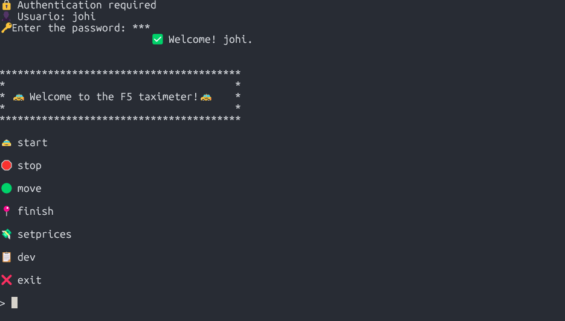
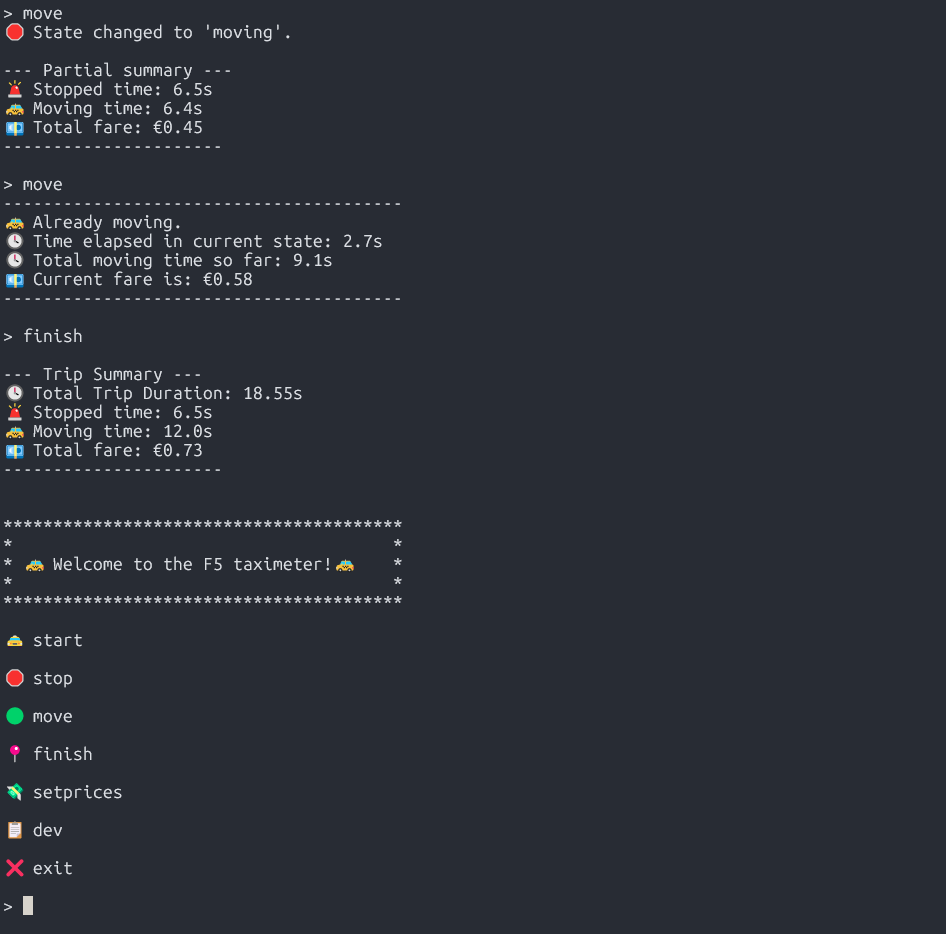
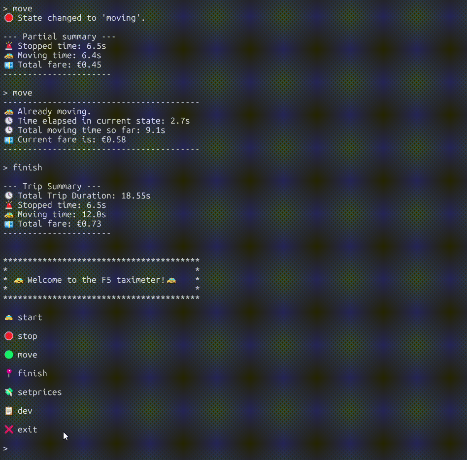
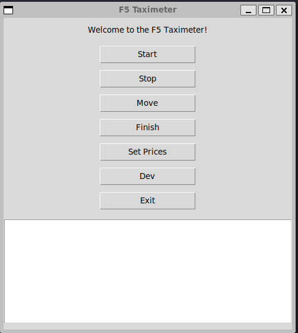
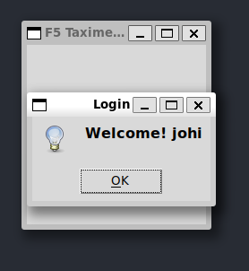
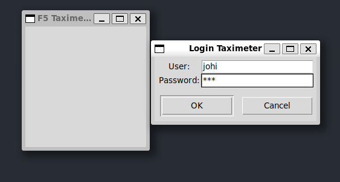
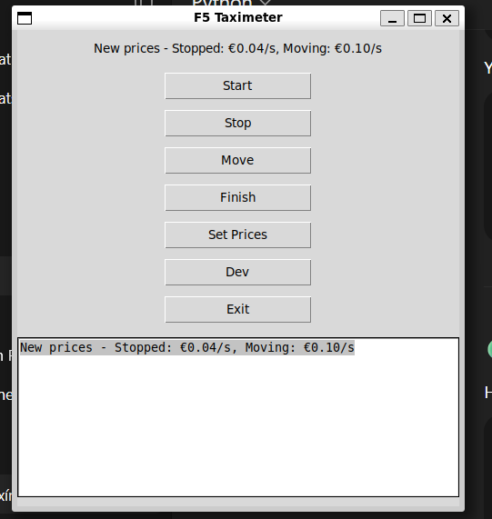
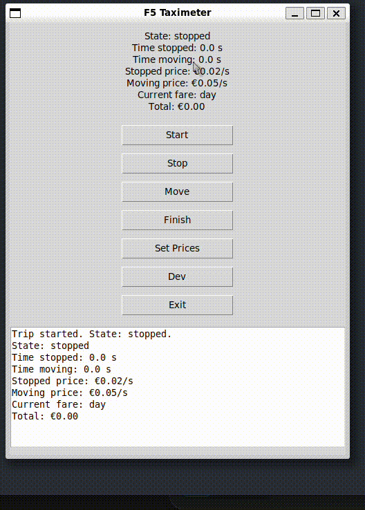

# 🚕 F5 Taxímetro

Taxímetro digital en Python con implementación escalonada: **nivel esencial**, **nivel medio**, **nivel avanzado** y **nivel experto**. Incluye versiones CLI, OOP, autenticación, logs, exportación de historial y una interfaz gráfica (GUI) en el nivel avanzado.
<div align="center">
  
</div>


## 📋 Características principales

- CLI interactiva y GUI para controlar el trayecto del taxi.
- Cálculo de tarifa en tiempo real:
  - **0.02 €/s** detenido.
  - **0.05 €/s** en movimiento.
- Cambio de precios manual y aplicación de **tarifa nocturna** o personalizada.
- Guardado automático del historial de trayectos en un archivo CSV.
- Sistema de logs detallado en `taximeter.log`.
- Modo desarrollador para visualizar logs y gestionar usuarios tanto en terminal como en GUI.
- Sistema de autenticación de usuarios (nivel avanzado).
- Interfaz gráfica (GUI) con login, control total del taxímetro, configuración de precios y visualización de logs.
- Actualización en tiempo real de tiempos y tarifas en la interfaz gráfica.
- Bienvenida con diseño decorativo y mensajes claros para el usuario.

## 🧱 Estructura del proyecto

```
    taximeter/
├── taximetro_esencial.py           # Nivel esencial (CLI básico)
├── taximetro_medio.py              # Nivel medio (logs, tests, configuración)
├── test_taximeter.py               # Pruebas unitarias (nivel medio/avanzado)
└── taximeter_avanzado/             # Nivel avanzado
    ├── main.py                     # CLI principal
    ├── main_gui.py                 # GUI principal (Tkinter)
    ├── taximeter.py                # Clase Taximeter (lógica OOP)
    ├── taximeter_gui.py            # Lógica de la GUI
    ├── config.py                   # Precios por defecto y configuración
    ├── auth.py                     # Gestión de usuarios y autenticación
    ├── taximeter.log               # Log del sistema
    ├── trip_history.csv            # Historial de viajes
    └── test_taximeter.py           # Pruebas unitarias (opcional)

```

## 📊 Niveles de Implementación

### 🟢 Nivel Esencial

- Programa CLI (línea de comandos) en Python.
- Al iniciar, da la bienvenida y explica su funcionamiento.
- Funcionalidades básicas:
  - Iniciar un trayecto.
  - Calcular tarifa mientras el taxi está parado (**0.02 €/s**).
  - Calcular tarifa mientras el taxi está en movimiento (**0.05 €/s**).
  - Finalizar un trayecto y mostrar el total en euros.
  - Permitir iniciar un nuevo trayecto sin cerrar el programa.

### 🟡 Nivel Medio

- Sistema de logs para trazabilidad.
- Tests unitarios para asegurar el correcto funcionamiento.
- Registro histórico de trayectos en un archivo de texto.
- Configuración de precios para adaptarse a la demanda.

### 🟠 Nivel Avanzado

- Refactorización a orientación a objetos (OOP).
- Sistema de autenticación con contraseñas.
- Interfaz gráfica de usuario (GUI) con Tkinter:
  - Login de usuario.
  - Control total del taxímetro (start, stop, move, finish).
  - Configuración de precios y tarifas.
  - Visualización de logs y gestión de usuarios desde el menú desarrollador.
  - Actualización en tiempo real de tiempos y tarifa.

## ▶️ Cómo ejecutar
### CLI (nivel esencial)
```bash
python taximetro_esecial.py
```
### CLI (nivel medio)
```bash
python taximetro_medio.py
```
### CLI (nivel avanzado)
```bash
python main_cli.py
```
### GUI (nivel avanzado)
```bash
cd taximeter_avanzado
python main_gui.py
```

## 🛠️ Comandos disponibles

| Comando     | Acción                                                  |
|-------------|--------------------------------------------------------|
| `start`     | Inicia un trayecto (estado inicial: detenido)          |
| `move`      | Cambia a estado “en movimiento” o actualiza el tiempo  |
| `stop`      | Cambia a estado “detenido” o actualiza el tiempo       |
| `finish`    | Finaliza el trayecto, muestra resumen y guarda CSV     |
| `setprices` | Configura precios personalizados o tarifa nocturna     |
| `dev`       | Muestra el historial de logs y gestiona usuarios       |
| `exit`      | Sale del programa   

## 📁 Ejemplo de CLI






## 🖥️ Ejemplo de la GUI

- Login de usuario.
- Botones para controlar el viaje (start, stop, move, finish).
- Configuración de precios y tarifas.
- Visualización de logs y gestión de usuarios desde el menú desarrollador.
- Actualización en tiempo real de tiempos y tarifa.








---

## 🧪 Pruebas unitarias

Puedes probar el cálculo de tarifas usando:

```bash
python -m unittest test_taximeter.py
python3 -m unittest test_taximeter_gui.py
```

## 🛠️ Tecnologías utilizadas

- Python
- Git y GitHub para control de versiones
- Tkinter para GUI (nivel avanzado)
- logging, unittest, csv, etc.

---

## 📦 Requisitos

- Python 3.8 o superior

## 📋 Enlace a tablero de Trello

[](https://trello.com/invite/b/6866e56d457e7db9b528f6c7/ATTI7fc82fd9e98f7c9c3848e56cd78725cc1BC82FF3/mi-tablero-de-trello)


## 🧑‍💻 Autor

Proyecto desarrollado por Johi Ortiz como parte del módulo 1 del curso del Bootcamp de IA P5 de Factoría F5.
